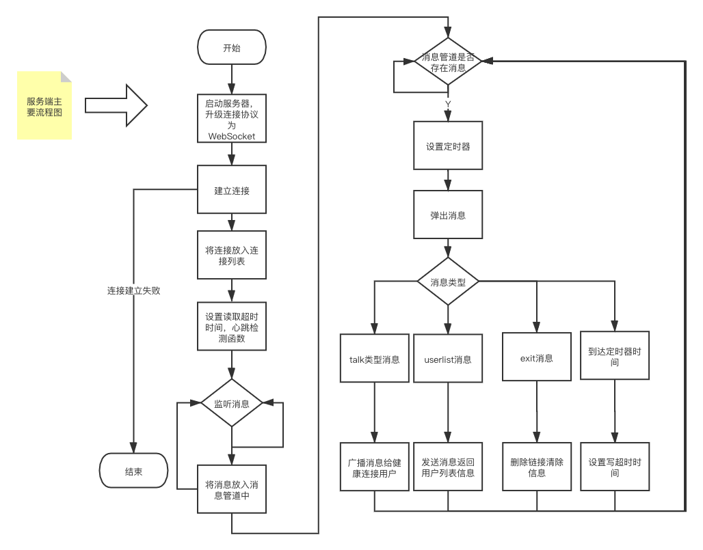
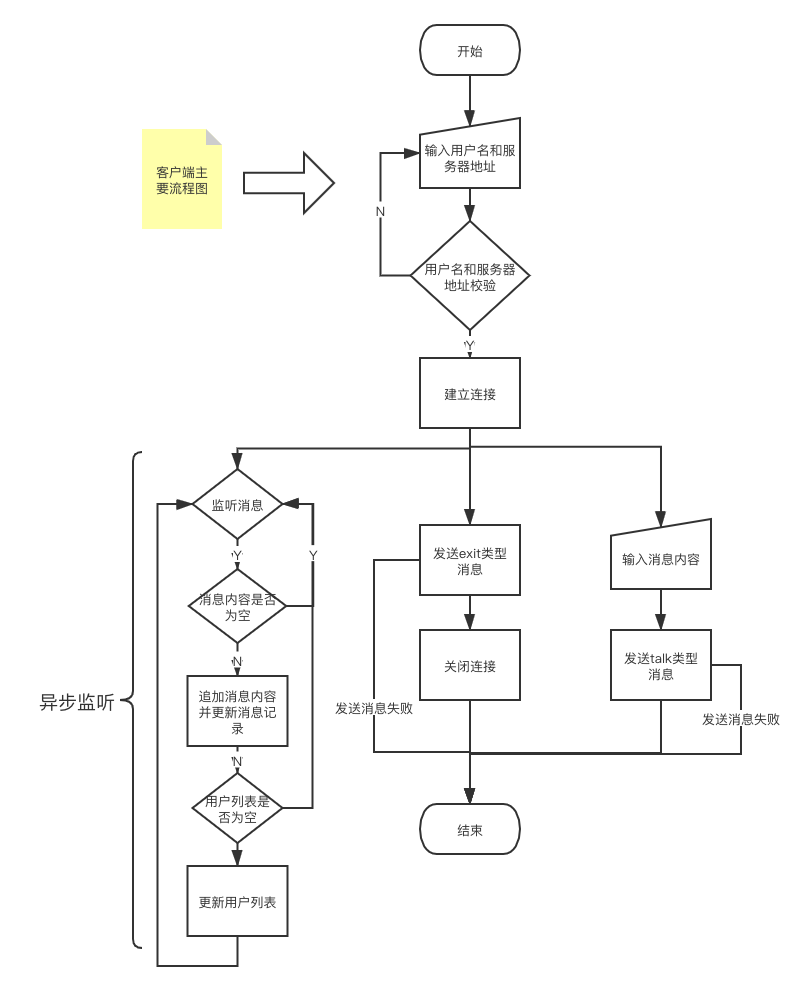

# chatroom技术文档
## 1.整体框架

一个基于**Websocket**协议的在线聊天服务，通信协议使用**Protobuf**，使用**logrus**进行日志管理

**服务端**功能:

1.  接受客户端发起的连接请求，建立ws连接（header中带username），支持ping/pong心跳
2.  维护管理多用户的ws连接
3. 收到talk类型消息，记录日志，把收到消息转发给所有连接的用户
4. 收到exit类型消息，断开连接，清理用户信息
5. 收到userlist消息，返回所有在线用户username

服务端主要流程图



**客户端**使用**fyne**开发，主要功能：

1. 连接管理：连接、断开、展示连接状态（连接、断开，基于心跳包判断）
2. 展示用户列表
3. 发送消息
4. 展示收到的消息

客户端主要流程图



## 2.目录结构

**目录结构**

```
├── Client.png                                        #客户端主要流程图
├── LICENSE                                           #开源许可证
├── README.md                                         #技术文档
├── Server.png                                        #客户端主要流程图
├── client
│   └── client.go                                     #客户端启动程序
├── config 
│   └── logconfig.go                                  #日志配置文件
├── ctrl
│   ├── clientcontroller.go                           #客户端控制层文件
│   └── servercontroller.go                           #服务端控制层文件
├── go.mod
├── go.sum
├── log
│   ├── chatroom.log -> chatroom.log.202106301734
│   └── chatroom.log.202106301734                     #日志文件
├── model
│   ├── chat_message.pb.go                            #消息实体go文件
│   └── chat_message.proto                            #消息实体proto文件
├── server
│   └── server.go                                     #服务端启动程序
├── service
│   └── service.go                                    #服务端逻辑层
├── test
│   ├── __pycache__
│   │   ├── chat_message_pb2.cpython-39.pyc
│   │   └── locustfile.cpython-39.pyc
│   ├── chat_message.proto 
│   ├── chat_message_pb2.py
│   ├── locustfile.py                                 #压测文件
│   └── report.html                                   #压测报告
└── view
    └── clientview.go                                 #客户端视图层文件
```


## 3.代码逻辑分层

|    层     |      文件夹      |              主要职责              |                  调用关系                  |     其他     |
| :-------: | :--------------: | :--------------------------------: | :----------------------------------------: | :----------: |
|  应用层   | /client，/server |              启动程序              |                 调用控制层                 | 不可同层相调 |
|  控制层   |      /ctrl       | 请求参数验证，处理请求构造回复结果 |             只可调用service层              | 不可同层相调 |
| service层 |     /service     |          处理具体业务逻辑          |      调用模型层，工具层，被控制层调用      | 不可同层相调 |
|  模型层   |      /model      |              数据模型              | 只可调用工具层，被业务逻辑层或者控制层调用 | 不可同层相调 |
|  工具层   |     /config      |         配置，日志，错误码         |      被应用层，service层，模型层调用       | 不可同层相调 |
|  视图层   |      /view       |  启动视图，设置相关按钮的回调函数  |          调用控制层，被应用层调用          | 不可同层相调 |

## 4.消息格式设计

消息设计拥有类型，用户名，内容，用户列表四个字段。其中消息类型有talk，exit，userlist三种类型

```protobuf
message ChatRoomRequest {
  string type = 1;
  string user_name = 2;
  string content = 3;
  map<string,string> user_list = 4;
}
```

## 5.接口设计

服务端接口地址为：[ws://127.0.0.1:9000/ws](ws//127.0.0.1:9000/ws )  

服务端会监听来自客户端的消息：

1. 收到talk类型消息，发送消息广播给所有健康连接用户，返回消息内容和用户名
2. 收到exit类型消息，删除链接，清除信息
3. 收到userlist类型信息，发送消息返回用户列表信息。

客户端首先输入地址和用户名进行连接，连接成功会监听消息：

1. 收到广播消息，刷新消息列表
2. 收到用户列表信息，刷新用户列表

## 6.第三方库

**Gorilla WebSocket**

```
用途 Go实现WebSocket的框架，使用其快速开发基于WebSocket的服务
文档 https://pkg.go.dev/github.com/gorilla/websocket
代码 https://github.com/gorilla/websocket
```

**Protobuf**

```
用途 消息通信
文档 https://developers.google.com/protocol-buffers
代码 https://github.com/protocolbuffers/protobuf
```

**logrus**

```
用途 日志管理
代码 https://github.com/sirupsen/logrus
```

**file-rotatelogs**

```
用途 日志分割
代码 https://github.com/lestrrat-go/file-rotatelogs
文档 https://pkg.go.dev/github.com/lestrrat-go/file-rotatelogs
```

**locust**

```
用途 进行压力测试
代码 https://github.com/locustio/locust
文档 https://locust.io/
```

**fyne**

```
用途 开发GUI程序
代码 https://github.com/fyne-io/fyne
文档 https://fyne.io/
```

## 7.如何执行

服务端 执行server.go （/server目录下）

```
go run server.go
```

客户端 执行client.go (/client目录下)

```
go run client.go 
输入用户名和服务器地址进行连接 本服务器地址设置为127.0.0.1:9000
```

## 8.todo

关于连接超时时间的设置有待优化，项目在压测时出现Broken pipe错误，有待改进连接释放的处理逻辑。

客户端页面可进一步优化。输入框的校验，错误提示需要完善。客户端需要支持中文，目前只支持英文。
